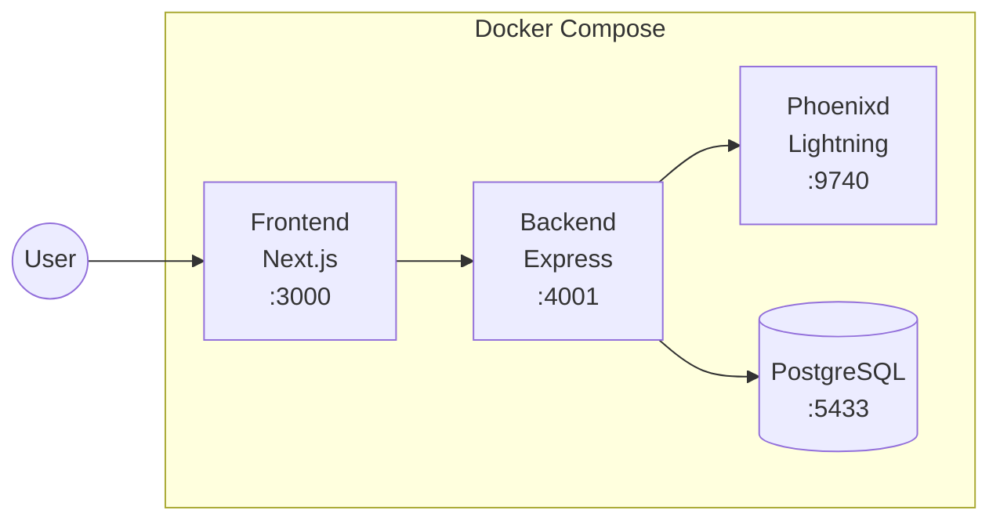

<p align="center">
  
</p>

<h1 align="center">Phoenixd Dashboard</h1>

<p align="center">
  <strong>A beautiful, modern dashboard for managing your <a href="https://github.com/ACINQ/phoenixd">phoenixd</a> Lightning node</strong>
</p>

<p align="center">
  <a href="#features">Features</a> •
  <a href="#screenshots">Screenshots</a> •
  <a href="#quick-start">Quick Start</a> •
  <a href="#tech-stack">Tech Stack</a> •
  <a href="#api">API</a>
</p>

<p align="center">
  
 
</p>

---

## Screenshots

<p align="center">
  
</p>

<p align="center">
  <em>Beautiful glassmorphism design with real-time payment activity chart</em>
</p>

<details>
<summary><strong>Receive Payments</strong></summary>
<p align="center">
  
</p>
<p align="center"><em>Create invoices with QR codes for easy sharing</em></p>
</details>

<details>
<summary><strong>Channel Management</strong></summary>
<p align="center">
  
</p>
<p align="center"><em>Visual representation of channel capacity and liquidity</em></p>
</details>

<details>
<summary><strong>Mobile View</strong></summary>
<p align="center">
  
</p>
<p align="center"><em>Fully responsive with iOS-style bottom navigation</em></p>
</details>

---

## Features

| Feature       | Description                                          |
| ------------- | ---------------------------------------------------- |
| **Overview**  | Node info, balance, channels, payment activity chart |
| **Receive**   | Create Bolt11 invoices & Bolt12 offers with QR codes |
| **Send**      | Pay invoices, offers, Lightning addresses, on-chain  |
| **Payments**  | Full payment history with filters & export to CSV    |
| **Channels**  | Visual channel capacity & liquidity management       |
| **Tools**     | Decode invoices/offers, estimate liquidity fees      |
| **LNURL**     | Pay, withdraw, and authenticate with LNURL           |
| **Real-time** | WebSocket notifications for incoming payments        |
| **Theme**     | Dark/Light/System theme support                      |
| **Mobile**    | Fully responsive with bottom navigation              |

---

## Quick Start

### Prerequisites

- [Docker](https://docs.docker.com/get-docker/) and Docker Compose
- Node.js 20+ (for local development only)

### Running with Docker

```bash
# Clone the repository
git clone https://github.com/your-repo/phoenixd-dashboard
cd phoenixd-dashboard

# Run the setup script (recommended for first time)
./setup.sh

# Open the dashboard
open http://localhost:3000
```

The setup script will:

- Create the data directory with proper permissions
- Start all Docker services
- Wait for phoenixd to initialize
- Automatically sync the generated password
- Restart the backend with the correct configuration

#### Troubleshooting Permission Issues

If you encounter a permission error like:

```
Failed to open /phoenix/.phoenix/phoenix.conf with Permission denied
```

Run the following commands to fix the data directory permissions:

```bash
# Stop the containers
docker compose down

# Fix permissions
chmod 777 ./data/phoenixd

# Or remove the data directory and start fresh
rm -rf ./data/phoenixd

# Run setup again
./setup.sh
```

**Manual start** (if you've already run setup):

```bash
docker compose up -d
```

### Local Development

<details>
<summary><strong>Backend</strong></summary>

```bash
cd backend
npm install
npx prisma generate
npx prisma db push
npm run dev
```

</details>

<details>
<summary><strong>Frontend</strong></summary>

```bash
cd frontend
npm install
npm run dev
```

</details>

---

## Architecture



| Service        | Description                       | Port |
| -------------- | --------------------------------- | ---- |
| **Frontend**   | Next.js 15 + React 19 + shadcn/ui | 3000 |
| **Backend**    | Express + TypeScript + Prisma     | 4001 |
| **Phoenixd**   | ACINQ Lightning Node              | 9740 |
| **PostgreSQL** | Payment history cache             | 5433 |

---

## Configuration

### Environment Variables

| Variable            | Description                    | Default              |
| ------------------- | ------------------------------ | -------------------- |
| `PHOENIXD_PASSWORD` | API password from phoenix.conf | **Required**         |
| `POSTGRES_USER`     | PostgreSQL username            | `phoenixd`           |
| `POSTGRES_PASSWORD` | PostgreSQL password            | `phoenixd_secret`    |
| `POSTGRES_DB`       | PostgreSQL database name       | `phoenixd_dashboard` |

### ⚠️ Network Warning

The dashboard runs phoenixd on **mainnet** by default.

> **You're dealing with real funds!** Always backup your seed phrase and test with small amounts first.

To switch to testnet, add `--chain testnet` to the phoenixd command in `docker-compose.yml`.

---

## 🔐 Backup & Recovery

### Getting Your Seed Phrase

Your seed phrase is the **only way** to recover your funds if something goes wrong. **Back it up immediately!**

#### From Docker Container

```bash
# View your seed phrase
docker exec phoenixd cat /phoenix/.phoenix/seed.dat

# Or save it to a file
docker exec phoenixd cat /phoenix/.phoenix/seed.dat > my-seed-backup.txt
```

#### From Local Data Directory

If you're using the default Docker setup, the seed is also available at:

```bash
cat ./data/phoenixd/seed.dat
```

### Important Files to Backup

| File           | Description                         | Location in Container            |
| -------------- | ----------------------------------- | -------------------------------- |
| `seed.dat`     | **12-word seed phrase** (CRITICAL!) | `/phoenix/.phoenix/seed.dat`     |
| `phoenix.conf` | Configuration & API password        | `/phoenix/.phoenix/phoenix.conf` |
| `channels.db`  | Channel state database              | `/phoenix/.phoenix/channels.db`  |

### Full Backup Script

```bash
#!/bin/bash
# Create a backup directory with timestamp
BACKUP_DIR="phoenixd-backup-$(date +%Y%m%d-%H%M%S)"
mkdir -p "$BACKUP_DIR"

# Copy all important files
docker exec phoenixd cat /phoenix/.phoenix/seed.dat > "$BACKUP_DIR/seed.dat"
docker exec phoenixd cat /phoenix/.phoenix/phoenix.conf > "$BACKUP_DIR/phoenix.conf"
docker cp phoenixd:/phoenix/.phoenix/channels.db "$BACKUP_DIR/channels.db" 2>/dev/null || echo "No channels.db yet"

echo "Backup saved to: $BACKUP_DIR"
echo "⚠️  Store this backup in a secure location!"
```

### Importing Your Seed to Another Wallet

Your phoenixd seed is a standard **BIP39 12-word mnemonic**. You can import it into:

- **Phoenix Mobile Wallet** (iOS/Android) - Same wallet, mobile version
- **Other Lightning wallets** - Check compatibility first
- **Bitcoin wallets** - For on-chain recovery only

#### Import to Phoenix Mobile

1. Install Phoenix wallet from [App Store](https://apps.apple.com/app/phoenix-wallet/id1544097028) or [Play Store](https://play.google.com/store/apps/details?id=fr.acinq.phoenix.mainnet)
2. Tap "I already have a wallet"
3. Enter your 12-word seed phrase
4. Your channels and balance will be restored

> ⚠️ **Warning:** Running the same seed on multiple devices simultaneously can cause channel conflicts and potential fund loss. Only use one instance at a time.

---

## API Endpoints

<details>
<summary><strong>Payments</strong></summary>

| Method | Endpoint                      | Description           |
| ------ | ----------------------------- | --------------------- |
| POST   | `/api/phoenixd/createinvoice` | Create Bolt11 invoice |
| POST   | `/api/phoenixd/createoffer`   | Create Bolt12 offer   |
| GET    | `/api/phoenixd/getlnaddress`  | Get Lightning address |
| POST   | `/api/phoenixd/payinvoice`    | Pay Bolt11 invoice    |
| POST   | `/api/phoenixd/payoffer`      | Pay Bolt12 offer      |
| POST   | `/api/phoenixd/paylnaddress`  | Pay Lightning address |
| POST   | `/api/phoenixd/sendtoaddress` | Send on-chain         |

</details>

<details>
<summary><strong>Node</strong></summary>

| Method | Endpoint                   | Description             |
| ------ | -------------------------- | ----------------------- |
| GET    | `/api/node/info`           | Node information        |
| GET    | `/api/node/balance`        | Balance                 |
| GET    | `/api/node/channels`       | List channels           |
| POST   | `/api/node/channels/close` | Close channel           |
| GET    | `/api/node/estimatefees`   | Estimate liquidity fees |

</details>

<details>
<summary><strong>Payment History</strong></summary>

| Method | Endpoint                       | Description            |
| ------ | ------------------------------ | ---------------------- |
| GET    | `/api/payments/incoming`       | List incoming payments |
| GET    | `/api/payments/incoming/:hash` | Get incoming payment   |
| GET    | `/api/payments/outgoing`       | List outgoing payments |
| GET    | `/api/payments/outgoing/:id`   | Get outgoing payment   |

</details>

<details>
<summary><strong>LNURL</strong></summary>

| Method | Endpoint              | Description    |
| ------ | --------------------- | -------------- |
| POST   | `/api/lnurl/pay`      | LNURL Pay      |
| POST   | `/api/lnurl/withdraw` | LNURL Withdraw |
| POST   | `/api/lnurl/auth`     | LNURL Auth     |

</details>

<details>
<summary><strong>WebSocket</strong></summary>

| Protocol | Endpoint | Description                     |
| -------- | -------- | ------------------------------- |
| WS       | `/ws`    | Real-time payment notifications |

</details>

---

## Contributing

Contributions are welcome! Please feel free to submit a Pull Request.

1. Fork the repository
2. Create your feature branch (`git checkout -b feature/amazing-feature`)
3. Commit your changes (`git commit -m 'Add amazing feature'`)
4. Push to the branch (`git push origin feature/amazing-feature`)
5. Open a Pull Request

---

## License

This project is licensed under the MIT License - see the [LICENSE](LICENSE) file for details.

---

## ⚠️ Disclaimer

This software is provided "as is" without warranty. Use at your own risk. Always backup your seed phrase and test with small amounts first.
